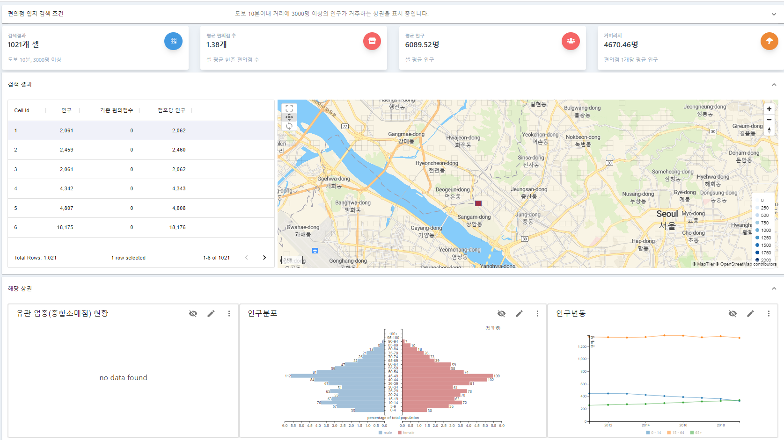
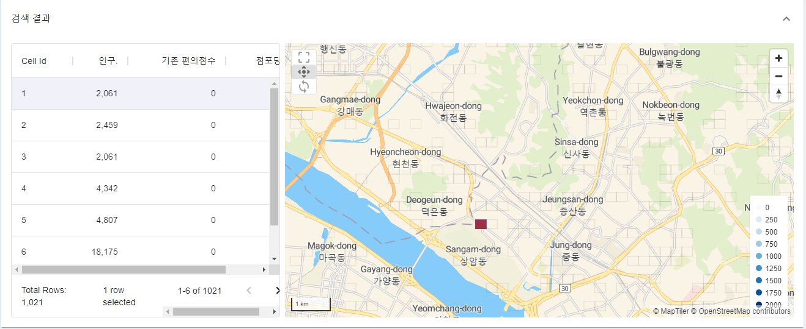
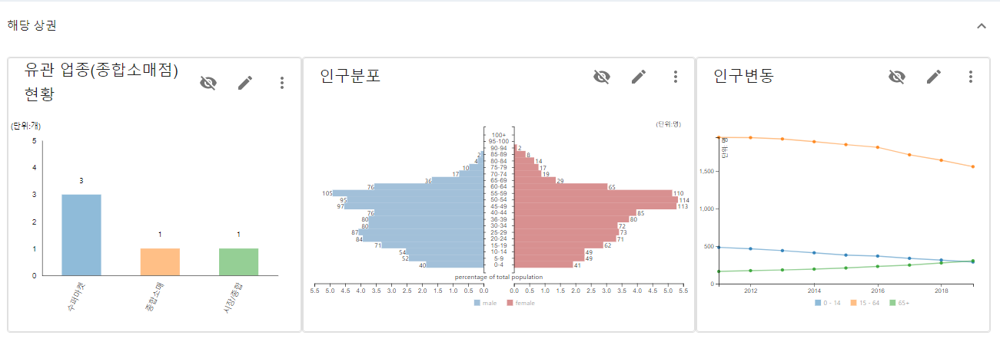
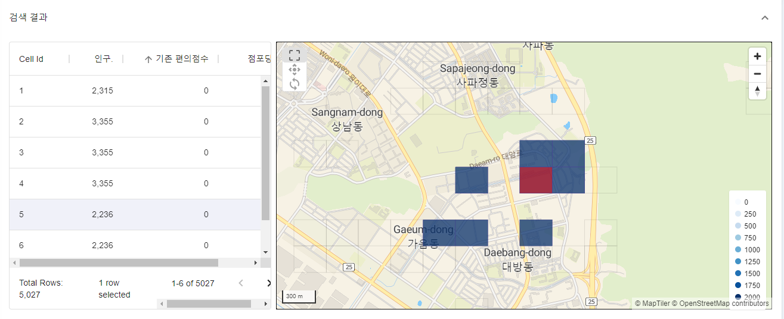
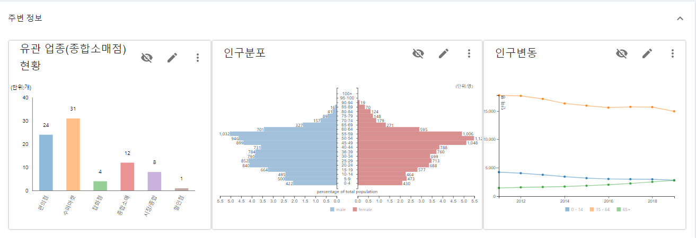
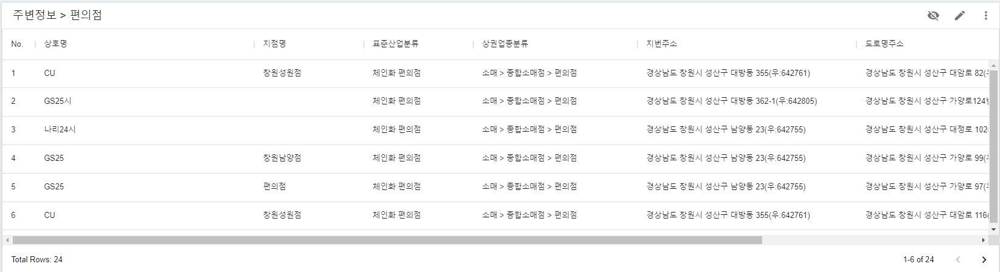

summary: 편의점 상권 조사에 활용하는 예시를 통해 격자형 통계 지도 서비스를 어떻게 활용할 수 있는 지 이해할 수 있습니다. 
id: gmaps-user-guide-cvs
categories:Grid Map
status: Published
authors: Jay S Han
Feedback Link: https://ubi-biz.github.io/

# 격자형 통계 지도 활용 사례:편의점 상권조사

## Welcome
Duration: 1

이 문서는 Ubimemes 격자형 통계 지도 서비스 중 '편의점 상권 조사' 화면의 구성 요소 및 조작 방법을 설명하기 위한 문서로, 편의점 출점을 계획하고 있는 예비 창업자를 대상으로 합니다.

본 문서를 통해 격자형 통계 지도 서비스의 활용 예시와 화면 조작 방법을 이해할 수 있습니다.

Positive
: 본 문서는 격자형 통계 지도를 상권 조사에 활용하는 구체적 예시를 편의점 사례에 적용한 내용으로, 화면 조작에 관한 기초적인 내용은 생략되어 있습니다.  화면 조작에 대한 기초적인 설명은 [사용자 가이드](/codelabs/gmaps-user-guide-overview/index.html) 를 참조하시면 됩니다.

기재된 내용에 오류(잘못된 내용, 맞춤법 오류, 불분명한 표현 등)가 있을 경우 좌측 하단의 'Report a mistake'링크를 통해 연락 주십시오.

## 개요
Duration: 3

편의점 상권 조사 화면은 인구조건과 경쟁업체 현황을 기반으로 출점 최적지를 검색하는 데 활용하기 위한 용도로 아래와 같은 구성으로 제작되었습니다.

## 1단계: 검색 조건 설정
Duration: 3

편의점은 '도보 5분 정도 거리에 인구 3,000명 이상'인 입지에 출점하도록 추천되고 있기 때문에 이 조건이 기본값으로 설정되어 있습니다.
조건을 변경하여 '재검색'버튼을 클릭하면 바뀐 조건으로 재검색 됩니다.

Positive
: 화면 로딩시 표시되는 초기 데이터, 재검색을 통해 검색되는 데이터는 전국을 대상으로 검색한 결과입니다.

## 2단계: 검색 대상 지역 선택(광역선택)
Duration: 3
1. 출점 하고자 하는 지역이 지도 안에 포함되도록 지도의 위치를 조절합니다.

1. 갱신 버튼 을 클릭하여 데이터를 갱신합니다.

Positive
: 갱신 버튼 클릭으로 검색되는 데이터는 지도상에 포함되어 있는 지역을 대상으로 한 결과입니다.

## 3단계: 1차 후보지 선정
Duration: 5

1. 지도 좌측 데이터 테이블의 '기존 편의점수', '인구'정보를 고려하여 적절한 데이터를 클릭합니다.
클릭에 따라 해당 셀(격자)이 지도 중심에 위치하게 되며 빨간 색으로 표시됩니다.

1. 지도 하단의 '해당 상권' 섹션에 표시되는 유관업종(경쟁업체) 현황 및 인구정보를 참고하여 후보지역을 추출합니다.

## 4단계: 주변 지역 조사
Duration: 5

1. 3단계의 과정을 통해 선정한 지역의 주변 지역을 마우스로 드래그 하면 주변 지역이 선택되고, 선택된 격자 정보는 지도 하단의 '주변정보' 섹션에 표시됩니다.

1. '주변정보'섹션에 표시되는 유관업종(경쟁업체) 현황 및 인구정보를 참고하여 후보지역을 추출합니다.

## 5단계: 최종 후보지 선정
Duration: 5

4단계까지의 과정으로 온라인 상으로 확인할 수 있는 작업은 완료되었고, 현지 조사를 통해 아래와 같은 요인에 대한 확인 작업이 필요합니다.
- 임대 물건 확인
- 점포 앞 통행 장애 요소 확인(가로수 등)
- 점포 앞 도보 통행량 확인
- 경사로 유무 확인
- 주변 경쟁업체 또는 유사 업종 상가업소 현황 조사

'해당상권' 또는 '주변정보'에 표시된 경쟁업체 현황 바챠트를 클릭하면 선택한 지역에 있는 해당 업종의 상가업소 목록을 화면 최하단의 데이터 테이블에서 확인할 수 있습니다.
해당 자료를 이용하여 현지 조사에 활용할 수 있습니다.

