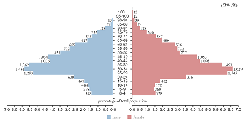

summary: 격자형 통계 지도 서비스의 기초적인 화면 조작을 이해할 수 있습니다.
id: gmaps-user-guide-overview
categories:Grid Map
status: Published
authors: Jay S Han
Feedback Link: https://ubi-biz.github.io/

# 격자형 통계 지도 사용자 가이드

<!-- 격자형 통계 지도란? -->
## Welcome
Duration: 1

<!-- 격자형 통계 지도란? -->
이 문서는 Ubimemes의 격자형 통계 지도 서비스를 이용하는 데 필요한 기초적인 사용방법을 설명하기 위한 문서입니다.

본 문서를 통해 격자형 통계 지도 서비스의 화면 구성과 기본적인 조작 방법을 이해할 수 있습니다.

Positive
: 본 문서는 격자형 통계 지도를 처음 접하시는 분들을 위한 내용으로 기술되어 있으므로 화면 조작에 이미 익숙하신 분들은 보실 필요 없습니다.

<!--
기재된 내용에 오류(잘못된 내용, 맞춤법 오류, 불분명한 표현 등)가 있을 경우 좌측 하단의 'Report a mistake'링크를 통해 연락 주십시오.
-->
## 개요
Duration: 5

Ubimemes의 격자형 통계 지도 서비스는 격자 지도를 기반으로 각종 데이터를 시각화하여 제공하는 서비스입니다.
조사 대상 지역을 마우스 드래그를 통하여 직관적으로 선택할 수 있으며, 선택한 지역 내의 통계정보를 다양한 형태의 차트로 확인할 수 있습니다.

화면 구성은 데이터 종류를 선택하기 위한 사이드바 메뉴와, 조사 지역 선택을 위한 격자지도, 선택 지역내의 정보를 표시하는 차트 및 데이터 테이블로 구성되어 있으며 각각의 특징을 아래에 소개합니다.

### 데이터 종류 선택
데이터 종류는 크게 소스 데이터의 특성을 있는 그대로 활용하기 위한 **기초데이터**와, 두개 이상의 데이터를 특정 목적으로 융합한 **응용데이터**로 분류하였습니다.

문서 작성 시점(2021년 1월) 기준, 기초데이터로는 인구현황과 상가업소현황을 제공하고 있으며, 응용데이터로는 상권조사를 목적으로 활용할 수 있는 데이터를 제공하고 있습니다.
제공하는 기초데이터의 출처는 아래와 같습니다.

| - | - | - |
|-------|----------|---------|
|**No.**| **목록** | **출처**|
| 1     | 인구현황 | 행정안전부 제공 '2019년도 주민등록인구현황'|
| 2     | 상가업소현황 | 소상공인진흥공단 제공 '2017년도 상가업소 현황'|

응용데이터인 상권조사데이터는 편의점과 치킨전문점을 예시로 제공하고 있습니다.

Positive
: 기초데이터와 응용데이터는 사회적 요구에 따라 지속적으로 개발하여 제공할 예정이며, 원본 데이터의 오류나 수정에 따라 예고 없이 변경될 수 있습니다.

Negative
: 인구현황은 시,군,구별로 집계되어 있는 행정안전부의 인구통계를 Ubimemes의 자체 알로리즘에 따라 250m 격자 단위로 변환한 데이터입니다. 변환과정에서 생기는 불가피한 오차가 있으며 선택 범위가 넓을수록(선택되는 격자가 많을수록) 오차가 적어 집니다. 다만, 선택 범위를 지나치게 넓게 하면 처리 속도가 다소 느려질 수 있습니다.

## 화면구성 I - 격자지도
Duration: 5

조사 대상 지역을 선택하는 데 필요한 기초적인 격자 지도 조작 설명입니다.

###지도의 확대/축소 /

 또는 아이콘을 클릭하거나 마우스 휠을 사용하여 지도의 배율을 확대 또는 축소할 수 있습니다.

Negative
: 성능 저하를 방지하기 위해 지도의 배율을 지나치게 작은 배율에서는 격자를 선택할 수 없도록 되어 있습니다. 격자가 표시되지 않을 경우 지도를 확대하여 적절한 배율로 표시되도록 하여야 합니다.

###지도의 이동 
아이콘이 선택된 상태에서 마우스를 드래그 하면 지도를 움직일 수 있습니다. Shift키를 누른채로 마우스를 드래그 하면 아이콘이 선택되지 않은 상태에서도 바로 이동시킬 수 있습니다.

###대상 지역의 선택 
아이콘이 선택된 상태에서 마우스를 드래그 하면 해당 영영이 선택됩니다. 선택된 격자는 정보의 밀도에 따라 그라디에이션으로 구분되어 표시됩니다. 선택되지 않거나 컬러가 표시되지 않는 격자는 관련 데이터가 없다는 것을 의미합니다.

###데이터의 갱신 
지도를 확대/축소했거나 이동함에 따라 서버로부터 데이터를 다시 받아와야 하는 경우에 필요한 기능입니다. 아이콘을 클릭하면 그 시점에 지도에서 표시하고 있는 전체 지역에 대한 데이터를 갱신합니다. 상권조사 서비스에서의 입지조건 검색에서 조사 대상 범위를 설정할 때 사용하고 있습니다.

## 화면구성 II - 차트
Duration: 5

### 인구 피라미드

img|text
---|---
 | 선택 지역의 인구분포를 5세 간격으로 표시합니다.   x축은 전체 인구에 대한 백분률을 나타냅니다.

### 라인차트

img|text
---|---
 | 데이타의 변동 추이를 시계열로 표시합니다.   라인위에 마우스를 올려 놓으면 상세한 정보가 표시 됩니다.

### 바차트

img|text
---|---
 | 항목의 명칭이 지나치게 길어서 차트로 표시하였을 때 위화감이 생기는 경우가 있어 긴 항목명은 일부  생략하여 표시합니다.  바 위에 마우스를 올리면 생략되지 않은 전체 항목 명을 확인할 수 있습니다.   처리하는 데이터의 성격에 따라 바를 클릭하여  주변의 다른 컴포넌트를 활성화 시키도록 사용되는  경우도 있습니다.

### 기타

기타 아래와 같은 차트를 포함하고 있습니다.

img1|img2
---|---
**파이차트**|**그룹 바차트**
|

**데이터 테이블**

## 화면조작
Duration: 1

전술한 화면구성에 기반한 격자형 통계 지도 서비스 각 메뉴의 조작 방법을 아래 문서에서 확인하실 수 있습니다.

- '기초데이터 - 인구현황' 조작 가이드 `(예정)`

- '기초데이터 - 상가업소현황' 조작 가이드 `(예정)`

- '상권분석 - 편의점상권'  조작 가이드 [바로가기](/codelabs/gmaps-user-guide-cvs/index.html)
